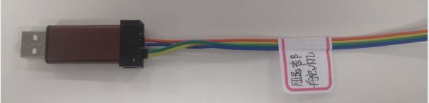
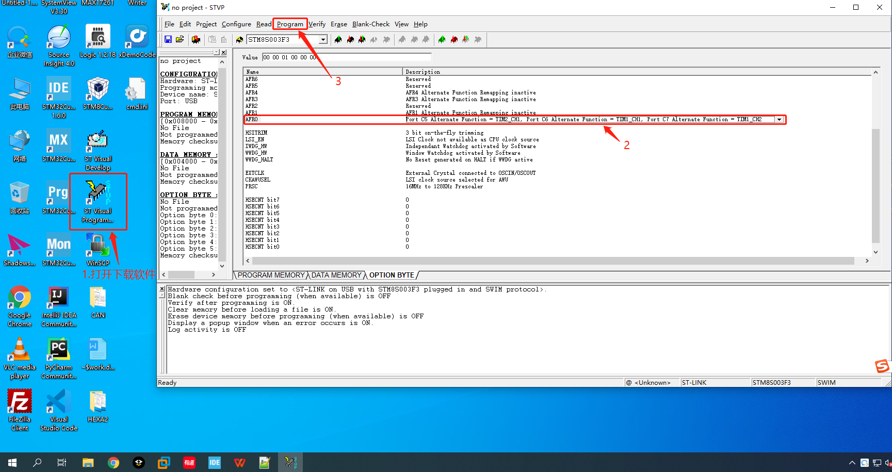
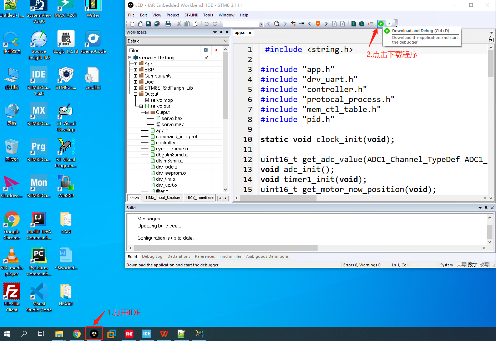

# 程序下载说明

## 1.选择下载器，按照板子上的丝印标记连接到硬件板子

## 2.设置STM8的可选字节，目的是配置引脚复用功能

注意：可选字节只需要配置一次即可，以后可忽略这一步直接下载主程序。

将AFR0设置为如图所示，连接上下载器，然后点击菜单栏的Program -> Current tab

## 3.打开IDE下载主程序

首先关闭第二步我们打开的下载软件 - ST Visual Programmer。

## 4.注意事项

有时会出现下载错误的情况，可按照如下方式排查：

* 1.首先确认连接的线序正确
* 2.保持下载器与板子的连接不动，重新插拔USB接口
